# D&D Character Sheet Webapp

A modern web application for managing Dungeons & Dragons character sheets.

## Features
- FastAPI backend with MongoDB integration
- REST API for character management
- Vite-powered frontend with client-side routing
- Character list view and navigation (Home, Characters, Search, Settings)

## Docker Architecture

The application runs as a multi-container Docker setup with automated data import and SPA routing support:



## Project Structure
```
backend/            # FastAPI backend
frontend/           # Vite frontend
docs/               # Documentation and diagrams
data/               # D&D 5e tools data for import
docker-compose.yml  # Multi-container orchestration
```

## Getting Started

### Docker Setup (Recommended)
Run the entire application stack with one command:
```sh
docker compose up --build
```

This will:
- Start MongoDB with persistent data storage
- Build and run the backend with automatic data import
- Build and run the frontend with SPA routing support
- Set up proper networking between all services

Access the application at:
- **Frontend**: http://localhost
- **Backend API**: http://localhost:8000
- **MongoDB**: localhost:28017

### Local Development Setup

#### Prerequisites
- Python 3.11+
- Node.js (v18+ recommended)
- MongoDB 8.0+

#### Backend Setup
1. Install dependencies:
   ```sh
   cd backend
   poetry install
   ```
2. Start the backend server:
   ```sh
   poetry run dev
   ```

#### Frontend Setup
1. Install dependencies:
   ```sh
   cd frontend
   npm install
   ```
2. Start the frontend dev server:
   ```sh
   npm run dev
   ```

### Usage
- Visit the application in your browser
- Navigate using the menu (Home, Characters, Search, Settings)
- Manage characters via the Characters page
- All D&D 5e data is automatically imported and searchable

## License
MIT


